# Google Quick Draw Classifier


Classifying images from Google Quick Draw dataset using custom
Convolutional Neural Network.

### What is Google Quick Draw?

About the Google Quick Draw:
> Quick, Draw! is an online game developed by Google that challenges players to 
> draw a picture of an object or idea and then uses a neural network artificial intelligence
> to guess what the drawings represent. The AI learns from each drawing, increasing its 
> ability to guess correctly in the future. The game is similar to Pictionary in that 
> the player only has a limited time to draw (20 seconds). The concepts that it guesses 
> can be simple, like 'foot', or more complicated, like 'animal migration'. This game is
> one of many simple games created by Google that are AI based as part of a project known 
> as 'A.I. Experiments'.


Open Soure dataset is available [here](https://github.com/googlecreativelab/quickdraw-dataset).


### How to prepare data for training ?

First make sure that you have the correct data. You can download
it from the link above. I have used the **Numpy bitmap files (.npy)** format.

For my experiment I have chosen the following **10** classes:
- Bear,
- Bee,
- Camel,
- Cat,
- Cow,
- Crab,
- Crocodile,
- Dog,
- Dolphin,
- Duck.

For our training we need the PNG files so we need to convert them from the numpy format. To do this,
firstly create a virtualenv:

```bash
$ virtualenv venv
```

Enter created virtualenv:

```bash
$ source venv/bin/activate
```

Install needed dependencies:
```bash
$ (venv) pip install -r requirements.txt
```

Now we can use `convert_to_png.py` script. It takes the data
from `in` folder and converts the defined number of numpy  files
to the PNG images.

For my experiment I have decided to have:
- 20 000 images in `training set`,
- 4 000 images in `validation set`,
- 1 000 images in `testing set`.

To convert our data, simply run:
```bash
$ (venv) python convert_to_png.py
```

### How to train

To start training the network simply run:
```bash
$ (venv) python training/convolutional.py <batch_size>
```

### Viewing results

You can view the training and validation accuracies and
losses in the TensorBoard. During each training the data
is saved to the `runs` directory.

During the training of after it, you can simply start up the 
TensorBoard with the following command:
```bash
$ (venv) tensorboard --logdir runs
```

### Classification visualisation

To get this kind of visualisation, simply head to the
`ClassificationVisualisation.ipynb`

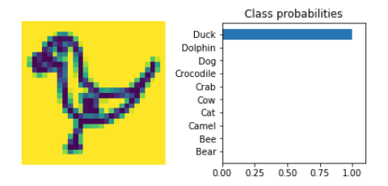

### Conducted experiments

I have conducted three experiments to see how would the network train with different values of the
**learning rate** and **batch size**.

Tested the following combinations:
- Learning rate=0.01 witch batch sizes=32, 64, 128, 256, 512
- Learning rate=0.001 witch batch sizes=32, 64, 128, 256, 512
- Learning rate=0.0001 witch batch sizes=32, 64, 128, 256, 512

Shared parameters during the experiments:

- Optimizer: **Adam**
- Epochs: **50**
- Dropout: **0.5**

#### First experiment (lr=0.01)

 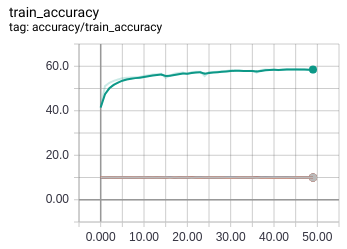 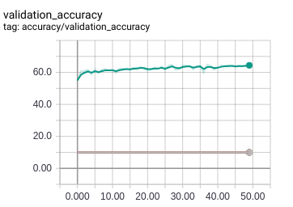
 
 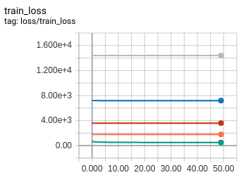  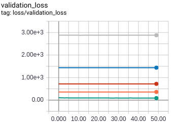


**Test accuracy:**

| Batch size | Accuracy | Color on the plot
|---|---|---|
| 32  | 10%  | Grey |
| 64  | 10%  | Blue |
|  128 |  10% | Red |
|  256 |  10% | Orange |
|  **512** | **65.13%**| **Green** |

**Summary**: In this experiment we can see that choosing such large large learning rate makes it
unable to actually hit a global minima. We can then observe the outcome of this: every model below the 512 
batch size was returning the same class which (when we have 10 classes) results in exactly 10% accuracy.

### Second experiment (lr=0.001)

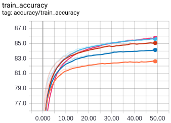 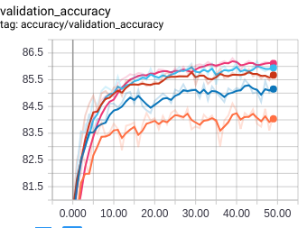
 
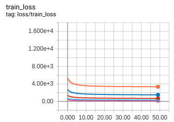  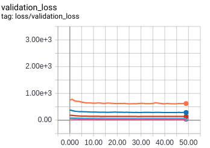

**Test accuracy:**

| Batch size | Accuracy | Color on the plot
|---|---|---|
| 32  | 83.82%  | Orange |
| 64  | 84.91%  | Blue |
|  128 |  85.78% | Red |
|  256 |  85.58% | Light blue |
|  **512** | **85.84%**  | **Magenta** |

**Summary**: In this experiment we can see that decreasing the learning rate 10x have a massive effect for the test
accuracy.

### Third experiment (lr=0.0001)

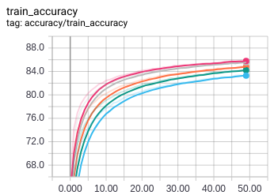 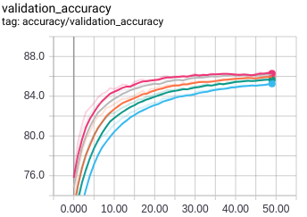
 
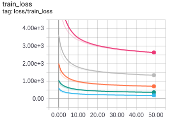  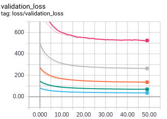

**Test accuracy:**

| Batch size | Accuracy | Color on the plot
|---|---|---|
| 32  | 85.77%  | Magenta |
| **64**  | **86.11%**  | **Grey** |
|  128 |  85.54% | Orange |
|  256 |  85.34% | Green |
|  512 | 84.57%  | Light blue |

**Summary**: In this experiment we can observe that decreasing learning rate even more did not improved the test
accuracy dramaticaly, but it did change the plots. They are much smoother due to fact that we are making much smaller
steps than before when searching for a global minima.
