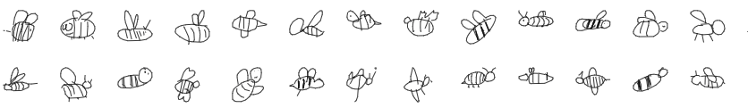

# Google Quick Draw Classifier



Classifying images from Google Quick Draw dataset using custom
Convolutional Neural Network.

### What is Google Quick Draw?

About the Google Quick Draw:
> Quick, Draw! is an online game developed by Google that challenges players to 
> draw a picture of an object or idea and then uses a neural network artificial intelligence
> to guess what the drawings represent. The AI learns from each drawing, increasing its 
> ability to guess correctly in the future. The game is similar to Pictionary in that 
> the player only has a limited time to draw (20 seconds). The concepts that it guesses 
> can be simple, like 'foot', or more complicated, like 'animal migration'. This game is
> one of many simple games created by Google that are AI based as part of a project known 
> as 'A.I. Experiments'.


Open Soure dataset is available [here](https://github.com/googlecreativelab/quickdraw-dataset).


### How to prepare data for training ?

First make sure that you have the correct data. You can download
it from the link above. I have used the **Numpy bitmap files (.npy)** format.

For my experiment I have chosen the following **10** classes:
- Bear,
- Bee,
- Camel,
- Cat,
- Cow,
- Crab,
- Crocodile,
- Dog,
- Dolphin,
- Duck.

For our training we need the PNG files so we need to convert them from the numpy format. To do this,
firstly create a virtualenv:

```bash
$ virtualenv venv
```

Enter created virtualenv:

```bash
$ source venv/bin/activate
```

Install needed dependencies:
```bash
$ (venv) pip install -r requirements.txt
```

Now we can use `convert_to_png.py` script. It takes the data
from `in` folder and converts the defined number of numpy  files
to the PNG images.

For my experiment I have decided to have:
- 20 000 images in `training set`,
- 4 000 images in `validation set`,
- 1 000 images in `testing set`.

To convert our data, simply run:
```bash
$ (venv) python convert_to_png.py
```

### How to train

To start training the network simply run:
```bash
$ (venv) python training/convolutional.py <batch_size>
```

### Viewing results

You can view the training and validation accuracies and
losses in the TensorBoard. During each training the data
is saved to the `runs` directory.

During the training of after it, you can simply start up the 
TensorBoard with the following command:
```bash
$ (venv) tensorboard --logdir runs
```

### Conducted experiments

I have conducted three experiments to see how would the network train with different values of the
**learning rate** and **batch size**.

Shared parameters during the experiments:

- Optimizer: **Adam**
- Epochs: **50**
- Dropout: **0.5**

#### First experiment (lr=0.01)


